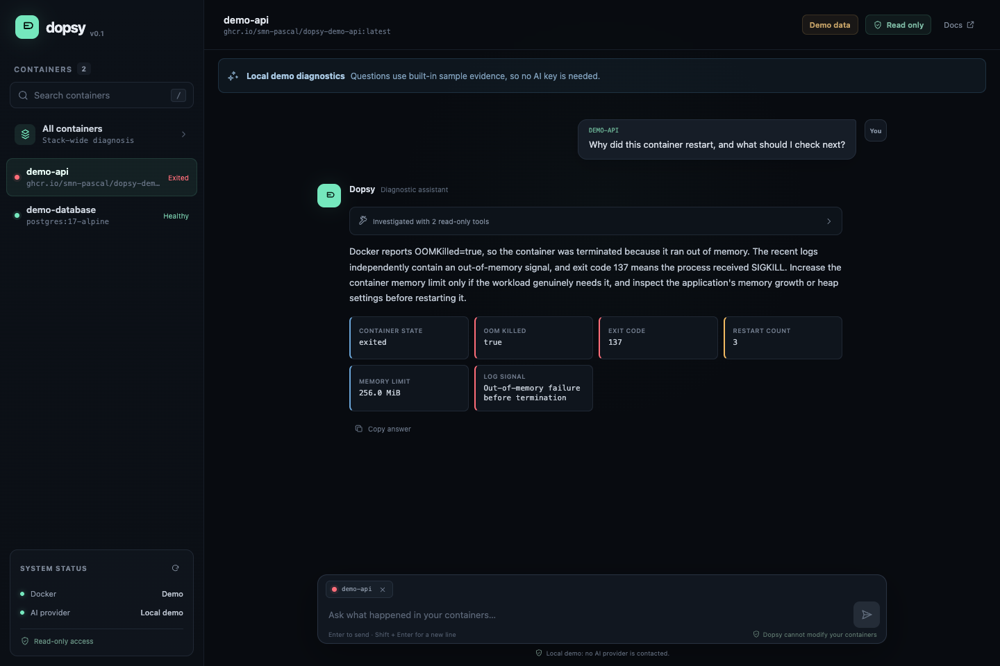
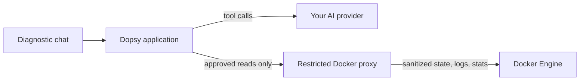

# Dopsy

> **Understand your containers.**

[](https://github.com/smn-pascal/dopsy/actions/workflows/ci.yml)
[](https://smn-pascal.github.io/dopsy/)
[](LICENSE)

Dopsy is a self-hosted, read-only diagnostic assistant for Docker. Ask what is wrong in plain language; Dopsy gathers focused evidence from container state, logs, and resource usage, then explains the likely cause and useful next steps.

> [!WARNING]
> Dopsy is an early development preview. Its security model and APIs are not yet considered stable. Keep it bound to localhost and do not expose it directly to the internet.



The screenshot uses Dopsy's built-in local demo. No Docker daemon, production logs, or external AI provider is involved.

## Why Dopsy?

Traditional log viewers show you what your containers printed. Dopsy is focused on the next question: **why did it happen?**

```text
"Why does my API keep restarting?"
        ↓
model requests only the evidence it needs
        ↓
inspect + bounded logs + current stats
        ↓
Exit 137 + OOMKilled + memory pressure
        ↓
evidence-based diagnosis and recommendations
```

- **Read-only by design:** no exec, start, stop, restart, delete, deploy, or mutation tools.
- **Agentic investigation:** a model can request another focused, read-only check when the first result raises a new question.
- **Bring your own model:** use an OpenAI-compatible cloud, company, or local endpoint.
- **Low overhead by default:** no permanent AI analysis and no metrics database in the first milestone.
- **Explainable output:** deterministic Docker facts remain visible alongside the generated diagnosis.

## Architecture



The model never receives Docker credentials and cannot call Docker directly. Dopsy validates and bounds each diagnostic request before the companion proxy reaches the Docker API.

## Quick start

```bash
git clone https://github.com/smn-pascal/dopsy.git
cd dopsy
cp .env.example .env
docker compose up --build
```

Open [http://localhost:8080](http://localhost:8080).

For installation details and configuration, read the [live documentation](https://smn-pascal.github.io/dopsy/).

To try the built-in example without an API key or production containers, set this in `.env`:

```dotenv
DOPSY_DEMO_MODE=true
```

To connect a tool-capable OpenAI-compatible endpoint:

```dotenv
DOPSY_LLM_BASE_URL=https://api.example.com/v1
DOPSY_LLM_API_KEY=replace-me
DOPSY_LLM_MODEL=your-model
```

Provider credentials stay on the server and are never returned to the browser.
Bounded log excerpts can still contain secrets. When an external provider is configured,
the excerpts selected during a diagnosis are sent to that provider.

## Security model

The recommended Compose setup gives the Dopsy application **no Docker socket mount**. A separate companion process holds the socket, sanitizes container metadata, and permits only an exact allowlist of diagnostic `GET`/`HEAD` routes and query parameters. Broad endpoints such as container archive/export and every mutating HTTP method are rejected.

This is deliberate: mounting `docker.sock` with `:ro` does not make the Docker API read-only. See [the read-only design](docs/security/read-only.md) for the threat model and current limitations.

## Development

The backend is written in Go. The web interface uses React, TypeScript, and Vite.

```bash
# terminal 1: demo API
make dev-api

# terminal 2: web UI
pnpm install
make dev-web
```

Run the verification suite before committing:

```bash
make test
pnpm typecheck
pnpm docs:build
```

## Project status

The v0.1.0 development preview contains a complete first vertical slice: container listing, bounded inspection tools, an OpenAI-compatible tool-calling loop, short-lived server-side chat context, a local demo diagnosis, and the read-only proxy boundary. Historical metrics, authentication, multi-host support, and alerting are intentionally outside this milestone.

See the [roadmap](ROADMAP.md), [changelog](CHANGELOG.md), [live documentation](https://smn-pascal.github.io/dopsy/), and [contribution guide](CONTRIBUTING.md).

## License

Dopsy is available under the [MIT License](LICENSE).
