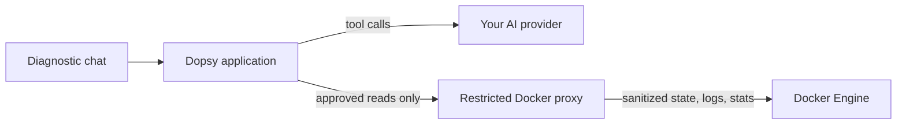

<p align="center">
  <picture>
    <source media="(prefers-color-scheme: dark)" srcset="brand/dopsy-logo-dark.svg">
    <source media="(prefers-color-scheme: light)" srcset="brand/dopsy-logo-light.svg">
    
  </picture>
</p>
<p align="center"><strong>Read-only Docker diagnostics, with the evidence attached.</strong></p>
<p align="center">
  <a href="https://github.com/smn-pascal/dopsy/actions/workflows/ci.yml"></a>
  <a href="https://smn-pascal.github.io/dopsy/"></a>
  <a href="LICENSE"></a>
</p>

Dopsy is a self-hosted diagnostic interface for Docker. Start with a bounded,
deterministic overview of current container state and resource use, then ask a
question in plain language. Dopsy gathers only the read-only evidence needed
for the investigation and shows both its diagnosis and the facts behind it.

> [!WARNING]
> Dopsy v0.1 is a development preview and does not include authentication. Keep it bound to localhost; do not expose it directly to the internet.


_Deterministic local demo; no Docker daemon, production data, or external model provider._

## Why Dopsy?

Logs tell you what a container printed. Dopsy connects those records to container state and current resource facts so you can investigate why something happened.

```text
"Why does my API keep restarting?"
        ↓
configured model selects from bounded read tools
        ↓
inspect + bounded logs + current stats
        ↓
Exit 137 + OOMKilled + memory pressure
        ↓
diagnosis, next checks, and visible evidence
```

- **Read-only boundary:** no exec, start, stop, restart, delete, create, or deployment operations.
- **Facts-first overview:** inspect current container posture without contacting an AI provider.
- **Bounded investigations:** rounds, tool calls, log windows, lines, bytes, and request time are capped.
- **Provider choice:** connect an OpenAI-compatible cloud, company, or local endpoint.
- **Evidence stays visible:** deterministic Docker facts are shown alongside the model-generated explanation.

## Architecture



The model never receives Docker credentials and cannot call Docker directly. Dopsy validates and bounds each diagnostic request before the companion proxy reaches the Docker API.

## Quick start

Use the published images without cloning or building the source:

```bash
mkdir dopsy && cd dopsy
curl -fsSLO https://raw.githubusercontent.com/smn-pascal/dopsy/v0.1.3/compose.yaml
curl -fsSLO https://raw.githubusercontent.com/smn-pascal/dopsy/v0.1.3/compose.images.yaml
curl -fsSLo .env https://raw.githubusercontent.com/smn-pascal/dopsy/v0.1.3/.env.example
docker compose -f compose.yaml -f compose.images.yaml up --pull always --no-build -d
```

This route needs Docker Compose 2.24.4 or newer. The two images share one
version tag and the existing Compose security settings. For a source build
instead, check out the same tag:

```bash
git clone --depth 1 --branch v0.1.3 https://github.com/smn-pascal/dopsy.git
cd dopsy
cp .env.example .env
docker compose up --build
```

Open [http://localhost:8080](http://localhost:8080).

For installation details and configuration, read the [live documentation](https://smn-pascal.github.io/dopsy/).
Use the versioned tag above for a reproducible install; clone `main` only when
you deliberately want the current development state.

To try the built-in example without an API key or production containers, set this in `.env`:

```dotenv
DOPSY_DEMO_MODE=true
```

To connect a tool-capable OpenAI-compatible endpoint:

```dotenv
DOPSY_LLM_BASE_URL=https://api.example.com/v1
DOPSY_LLM_API_KEY=replace-me
DOPSY_LLM_MODEL=your-model
```

Provider credentials stay on the server and are never returned to the browser.
Bounded log excerpts can still contain secrets. When an external provider is configured,
the excerpts selected during a diagnosis are sent to that provider.

## Security model

The recommended Compose setup gives the Dopsy application **no Docker socket mount**. A separate companion process holds the socket, sanitizes container metadata, and permits only an exact allowlist of diagnostic `GET`/`HEAD` routes and query parameters. Broad endpoints such as container archive/export and every mutating HTTP method are rejected.

This is deliberate: mounting `docker.sock` with `:ro` does not make the Docker API read-only. See [the read-only design](docs/security/read-only.md) for the threat model and current limitations.

## Development

The backend is written in Go. The web interface uses React, TypeScript, and Vite.

```bash
# terminal 1: demo API
make dev-api

# terminal 2: web UI
pnpm install
make dev-web
```

Run the verification suite before committing:

```bash
make test
pnpm typecheck
pnpm docs:build
```

## Project status

Dopsy is pre-1.0 software. The current preview covers a bounded live overview
and one diagnostic path end to end: container discovery, sanitized inspection,
recent logs, current resource statistics, model-guided tool calls, and visible
supporting evidence. Historical metrics, authentication, multi-host operation,
alerting, and automated remediation are not implemented.

See the [roadmap](ROADMAP.md), [changelog](CHANGELOG.md), [live documentation](https://smn-pascal.github.io/dopsy/), and [contribution guide](CONTRIBUTING.md).

## License

Dopsy is available under the [MIT License](LICENSE).
